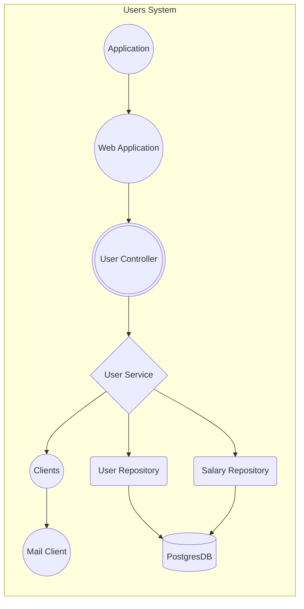

## Implementation details

Hi! This section is being used to explain some decisions/shortcomings of implementation, requirements to run the app, how to consume the endpoints and structure of the project.

#### Requirements to run the app

- Elixir 1.14.3
- Erlang 25.2
- Postgres 14.5

#### Step by step to run the app:

- Access the project's root folder
- Run `mix setup` to install, setup dependencies, setup database, seed the database and run the necessary migrations
- Run `mix phx.server` to start the server
- Open a new terminal tab and run `curl -X GET http://localhost:4000/users` to list all users and their active salaries
- Open a new terminal tab and run `curl -X GET http://localhost:4000/users?name=John` to list all users with the name John and their salaries
- Open a new terminal tab and run `curl -X POST http://localhost:4000/invite-users` to send an email to all users with active salaries
- (optional) `mix test` - to run the tests
- If you do prefer to consume the APIs on an API Client, it is recommended using [Insomnia](https://insomnia.rest/download) or [Postman](https://www.postman.com/downloads/)

#### Endpoints available in the application:

- `GET /users` - List all users and their active salaries
- `GET /users?name=John` - Same endpoint as above, but with the option to filter by partial user name and their salaries
- `POST /invite-users` - Send an email to all users with active salaries

#### Decisions/shortcomings of my implementation:

- The project was structured in different layers, separating the business logic from the web layer, services, entities, schemas, etc. It makes the code more maintainable, scalable and testable,in a way that it's easily extendable to add more features, functionalities and endpoints for managing users. Features such as offboarding, onboarding, etc.

- `GET /users`: It was created an endpoint to list all users and their active salaries. It was also created an option to filter by partial user name and order by name. I have created this option as it was defined on the requirements, but it's easily adaptable in the future to filter by other fields, like salary range, etc.

- `POST /invite-users`: I have created an endpoint to send an email to all users with active salaries, as defined by the requirement. To do this, I have implemented a client layer to send emails, as it's easily adaptable in the future to replace to a real email client, like [SendGrid](https://github.com/alexgaribay/sendgrid_elixir) or [Bamboo](https://github.com/thoughtbot/bamboo).

- Act of sending emails: The way that was implemented, it uses `Task.async` to send emails to users in parallel. As sending emails could turn into a bottleneck to the application due to an external network communication with an email client and it can take some time to wait for the response, it was used the benefits of Elixir being built in top of Erlang, using principles such as:

  - Concurrency: notification to the user is a perfect scenario where it can benefit of concurrency, as it can be performed multiple computations - sending emails to each user - at the same time.
  - Isolation: Each task is running in its own process on the green threads from BEAM, isolated from other processes, so if one of the tasks fails, it won't affect the stability of the application.
  - Scalability: what Elixir has the best, his excellent of distributing work across multiple processes and take advantage of all the cores of the machine (BEAM). In this case, if there's need to send emails to more users, let's say 100k+ users, it can easily work.

- I have implemented a considerable amount of unit tests to cover the main functionalities of the application and the scenarios. The test scenarios covers mainly where the user has salary or not, if the salary is active or not, when the user has multiple salaries associated and should be retuned only the active one. Other scenarios if the user does not have any salary, or even the email library returns a communication error.

- Seeding the database with `seeds.exs`: It was noticed a slow performance to seed the database with 20k users. At the initial phase of development, calculating the time difference between the start and end of the seeding process, it took 31 seconds using synchronous requests operations to the database.
  - So it was implemented a better way to seed using `Task.async_stream`, to handle concurrent processes dealing with creating our users and salaries data. The usage of asynchronous tasks decreased the execution time from 31 seconds to 7 seconds (more than 4x faster) for 20.000 users. The `invite-users` feature uses the same async logic. The code is available on the `seeds.exs` file.
  - Other area of improvement would be to create batches of users and salaries to be inserted in the database, instead of inserting one by one. It would improve the performance even more.

#### Next steps and future improvements:

- Potential refactorings: As the system scales and more users are onboarded to system, it will start taking time to retrieve the users and their active salaries to render in the Single Page Application on customers browser. A scenario would be to implement pagination to the endpoint `GET /users` to improve the performance and avoid timeouts. The `/users` endpoint could receive `page_number` and `page_size` as query params to paginate the results. On the user entity,it queries the database with the `limit` option based on the `page_size`.
- Another refactoring is to implement indexes to optimize the database queries. Indexes on the `users` table for the `name` field and on the `salaries` for the `active` fields. The index for `user_id` is already created.

- Scalability: A suggestion to improve the performance and scale the application would be to use a queue system to manage the invite-users feature like Oban, to send emails to users in the background, so the user doesn't need to wait for the response of the request to receive the email. Besides that, it would have more control over the retries in case of failure, etc. I personally have used Oban in other projects and it's a great tool to work with.

- Integration tests: As the unit tests were implemented, there is room to implement integration tests to cover an external communication with a real email client, using [Mox](https://github.com/dashbitco/mox) or [Bypass](https://elixirschool.com/en/lessons/testing/bypass) to mock the email client. As it was used an internal library to send emails, it seems to be a bit overkill to implement integration tests for this scenario, but it's a good practice to have it.

- CI/CD workflows: Another suggestion would be to implement a CI/CD pipeline to run the tests, build the application, run quality and security checks with [Credo](https://github.com/rrrene/credo) and [Sobelow](https://github.com/nccgroup/sobelow) and deploy it to a cloud provider, AWS, etc. I have used Github Actions in my current activities and it's been a great experience.

- Logging: It was mostly used the default logger from Elixir, but it would be awesome to configure [Telemetry Metrics](https://hexdocs.pm/telemetry_metrics/Telemetry.Metrics.html#:~:text=Metrics%20are%20aggregations%20of%20Telemetry,the%20system's%20behaviour%20over%20time.&text=This%20documentation%20is%20going%20to,integrate%20those%20metrics%20with%20reporters.) to start emitting metrics events when a success or error happens, e.g when an email is sent successfully or when an error happens when sending an email. Once Telemetry is configured on the application, it could emit events as per docs:

  ```elixir
  defp emit_metric(metric, meta) do
    spawn(fn ->
      :telemetry.execute([:users, :email, :invite, metric], %{total: 1}, meta)
    end)
  end
  ```

  And in case of error sending invite emails:

  ```elixir
    emit_metric(:error, %{error: :timeout_communication_with_email_client})
  ```

- Monitoring: It would be great to have a tool like [Sentry](https://sentry.io/for/elixir/) or any other tool to monitor the application and receive alerts when an error happens, so it can take action and fix it as soon as possible.

- Long-term solution for users application:
  - Event-drive architecture using [Broadway](https://github.com/dashbitco/broadway) behaviour, having producers responsible to publish the events (users and emails) and a consumer responsible to consume the events manage the users and send emails. It would be a great solution to scale the application and have a more robust architecture. With the event-drive approach it would have mechanisms such as retries, back-pressure to have the capability of dealing with an unusual amount of traffic, dead-letter queues, etc.

#### General project structure:

- Decisions on the project's structure:
  - `clients`: folder that contains the clients defined in the application, in this case the BEChallengex client to send emails. It's easily extendable to add more clients or even to add more methods to the existing clients.
  - `entities`: groups the main entities of the application, providing a centralized location to define and manage logic related to these entities. In this case user and salaries.
  - `schemas`: contains the schemas of the entities, in this case the schemas of users and salaries.
  - `types`: contains the Enum types of the application, in this case the currency type facilitating the management and consistent usage of these types.
  - `services`: application's business logic, allowing for separation of concerns and the creation of specialized services that handle logic.
  - `controllers`: contains the application's controller, helping to separate the logic for handling HTTP requests with underlying services.

```bash
lib/
├── be_exercise
│   ├── application.ex
│   ├── clients
│   │   └── emailer.ex
│   ├── entities
│   │   ├── salaries.ex
│   │   ├── schemas
│   │   │   ├── salary.ex
│   │   │   └── user.ex
│   │   ├── types
│   │   │   └── currency_type.ex
│   │   └── users.ex
│   ├── repo.ex
│   └── services
│       └── user_service.ex
├── be_exercise.ex
├── be_exercise_web
│   ├── controllers
│   │   ├── error_json.ex
│   │   ├── page_json.ex
│   │   └── user_controller.ex
│   ├── endpoint.ex
│   ├── gettext.ex
│   ├── router.ex
│   └── telemetry.ex
└── be_exercise_web.ex
```

#### Application diagram flow:

- High level diagram explaining the flow of the application



#### Original exercise description

# Backend code exercise

Hi there!

If you're reading this, it means you're now at the coding exercise step of the engineering hiring process. We're really happy that you made it here and super appreciative of your time!

In this exercise you're asked to create a Phoenix application and implement some features on it.

> 💡 The Phoenix application is an API

If you have any questions, don't hesitate to reach out directly to [code_exercise@remote.com](mailto:code_exercise@remote.com).

## Expectations

- It should be production-ready code - the code will show us how you ship things to production and be a mirror of your craft.
  - Just to be extra clear: We don't actually expect you to deploy it somewhere or build a release. It's meant as a statement regarding the quality of the solution.
- Take whatever time you need - we won’t look at start/end dates, you have a life besides this and we respect that! Moreover, if there is something you had to leave incomplete or there is a better solution you would implement but couldn’t due to personal time constraints, please try to walk us through your thought process or any missing parts, using the “Implementation Details” section below.

## What will you build

A phoenix app with 2 endpoints to manage users.

We don’t expect you to implement authentication and authorization but your final solution should assume it will be deployed to production and the data will be consumed by a Single Page Application that runs on customer’s browsers.

To save you some setup time we prepared this repo with a phoenix app that you can use to develop your solution. Alternatively, you can also generate a new phoenix project.

## Requirements

- ✅ We should store users and salaries in PostgreSQL database.
- ✅ Each user has a name and can have multiple salaries.
- ✅ Each salary should have a currency.
- ✅ Every field defined above should be required.
- ✅ One user should at most have 1 salary active at a given time.
- ✅ All endpoints should return JSON.
- ✅ A readme file with instructions on how to run the app.

### Seeding the database

- `mix ecto.setup` should create database tables, and seed the database with 20k users, for each user it should create 2 salaries with random amounts/currencies.
- The status of each salary should also be random, allowing for users without any active salary and for users with just 1 active salary.
- Must use 4 or more different currencies. Eg: USD, EUR, JPY and GBP.
- Users’ name can be random or populated from the result of calling list_names/0 defined in the following library: [https://github.com/remotecom/be_challengex](https://github.com/remotecom/be_challengex)

### Tasks

1. 📄 Implement an endpoint to provide a list of users and their salaries

   - Each user should return their `name` and active `salary`.
   - Some users might have been offboarded (offboarding functionality should be considered out of the scope for this exercise) so it’s possible that all salaries that belong to a user are inactive. In those cases, the endpoint is supposed to return the salary that was active most recently.
   - This endpoint should support filtering by partial user name and order by user name.
   - Endpoint: `GET /users`

2. 📬 Implement an endpoint that sends an email to all users with active salaries
   - The action of sending the email must use Remote’s Challenge lib: [https://github.com/remotecom/be_challengex](https://github.com/remotecom/be_challengex)
   - ⚠️ This library doesn’t actually send any email so you don’t necessarily need internet access to work on your challenge.
   - Endpoint: `POST /invite-users`

### When you're done

- You can use the "Implementation Details" section to explain some decisions/shortcomings of your implementation.
- Open a Pull Request in this repo and send the link to [code_exercise@remote.com](mailto:code_exercise@remote.com).
- You can also send some feedback about this exercise. Was it too big/short? Boring? Let us know!

---

## How to run the existing application

You will need the following installed:

- Elixir >= 1.14
- Postgres >= 14.5

Check out the `.tool-versions` file for a concrete version combination we ran the application with. Using [asdf](https://github.com/asdf-vm/asdf) you could install their plugins and them via `asdf install`.

### To start your Phoenix server

- Run `mix setup` to install, setup dependencies and setup the database
- Start Phoenix endpoint with `mix phx.server` or inside IEx with `iex -S mix phx.server`

Now you can visit [`localhost:4000`](http://localhost:4000) from your browser.

---
